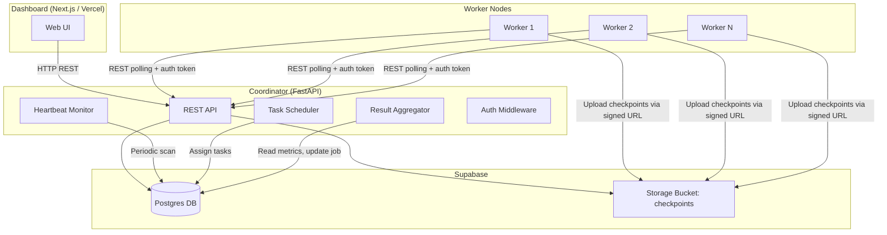
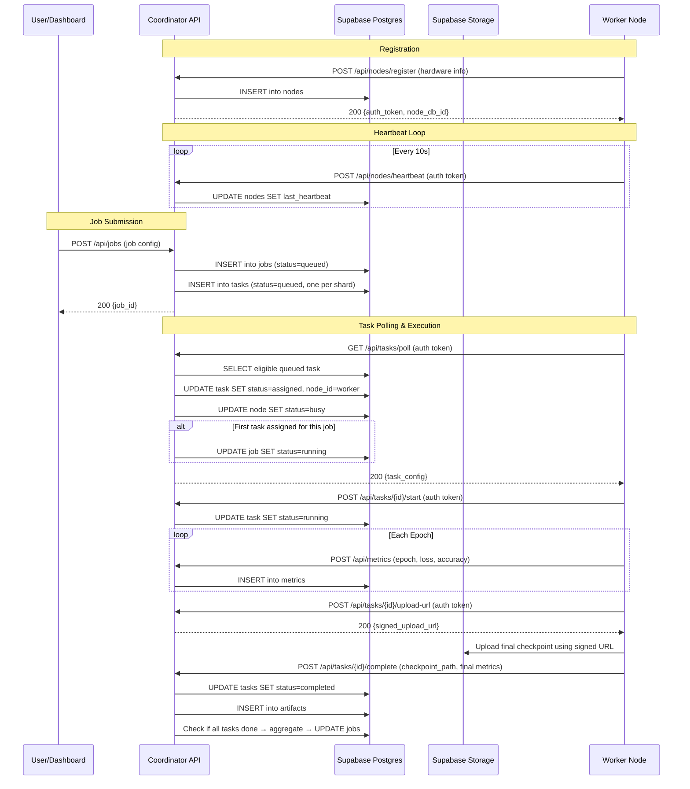

# Design Document: Group ML Trainer

## Overview

Group ML Trainer is a distributed ML task orchestration platform with three main components: a **Coordinator** (FastAPI backend), **Workers** (Python agents on local machines), and a **Dashboard** (Next.js frontend). The Coordinator manages job lifecycle, task assignment, and result aggregation. Workers poll for tasks, execute PyTorch training runs, and report metrics/artifacts. The Dashboard provides real-time visibility into nodes, jobs, and training progress.

For the MVP, training is **embarrassingly parallel** — each Worker trains an independent model instance on its assigned dataset shard. There is no synchronized gradient exchange or model merging. The Coordinator aggregates per-task metrics (mean loss, mean accuracy, per-node breakdown) and tracks artifact locations.

### Key Design Decisions

1. **REST polling over WebSockets**: Workers poll the Coordinator for task assignments. This simplifies deployment on heterogeneous local hardware where NAT/firewall traversal is common. The Dashboard uses short-interval polling (or SSE) for near-real-time updates.

2. **Supabase as unified backend**: Postgres for relational data, Supabase Storage for checkpoint/artifact files. This eliminates the need for separate object storage infrastructure.

3. **Token-based Worker auth**: Each Worker receives a unique auth token at registration. The Coordinator stores a hash (SHA-256) and validates tokens on every request via a FastAPI dependency.

4. **Independent task execution**: Each task is a self-contained training run. Workers receive task configuration from the Coordinator, load their assigned dataset shard locally, train, upload checkpoints to Supabase Storage, and report metrics. No inter-worker communication is required.

5. **Supabase Storage ownership**: Workers upload checkpoint files to Supabase Storage using Coordinator-issued signed upload URLs. Workers do not hold direct privileged Supabase credentials and do not write directly to relational tables; all database state changes go through the Coordinator API.

---

## Architecture

### System Architecture Diagram



### Request Flow



---

## Components and Interfaces

### 1. Coordinator (FastAPI Backend)

The Coordinator is the central authority. It exposes a REST API consumed by both Workers and the Dashboard.

#### API Endpoints

| Method | Path | Auth | Consumer | Description |
|--------|------|------|----------|-------------|
| POST | `/api/nodes/register` | None | Worker | Register a new node, returns auth token |
| POST | `/api/nodes/heartbeat` | Token | Worker | Update heartbeat timestamp |
| GET | `/api/nodes` | None (local/demo only) | Dashboard | List all nodes with status |
| POST | `/api/jobs` | None (local/demo only) | Dashboard | Submit a new training job |
| GET | `/api/jobs` | None (local/demo only) | Dashboard | List all jobs |
| GET | `/api/jobs/{id}` | None (local/demo only) | Dashboard | Get job details with aggregated metrics |
| GET | `/api/jobs/{id}/results` | None (local/demo only) | Dashboard | Get aggregated metrics + per-task checkpoints |
| GET | `/api/tasks/poll` | Token | Worker | Worker polls for at most one eligible queued task; the Coordinator selects one task, assigns it to the polling Worker, marks the Worker busy, and returns the task config. Returns empty if no task is available. |
| POST | `/api/tasks/{id}/upload-url` | Token | Worker | Generate a signed upload URL for checkpoint storage |
| POST | `/api/tasks/{id}/start` | Token | Worker | Mark task as running |
| POST | `/api/tasks/{id}/complete` | Token | Worker | Report task completion with checkpoint path |
| POST | `/api/tasks/{id}/fail` | Token | Worker | Report task failure with error message |
| POST | `/api/metrics` | Token | Worker | Report epoch metrics |
| GET | `/api/jobs/{id}/artifacts` | None (local/demo only) | Dashboard | List artifacts for a job |
| GET | `/api/monitoring/summary` | None (local/demo only) | Dashboard | System summary (node counts, job counts) |

> **Note:** Dashboard-facing read endpoints are unauthenticated in the MVP and intended for local/demo use only. Worker-facing and mutating Coordinator endpoints remain protected by Worker auth token validation.

#### Internal Modules

- **`auth.py`** — Token generation (secrets.token_urlsafe), hashing (SHA-256), and FastAPI dependency for token validation.
- **`scheduler.py`** — Task creation from job config. On poll, selects an eligible queued task, assigns it to the polling Worker (pull-based model), marks the Worker busy, and returns the task config. The Coordinator only assigns a task to a node whose reported resources satisfy the task's minimum requirements: sufficient RAM (`ram_mb` >= configured minimum) and, if the job configuration requests GPU, the node must have a non-null `gpu_model`. In the MVP, minimum resource requirements are derived from model type and dataset defaults rather than specified explicitly by the user. The Coordinator maintains a simple lookup of default resource requirements per model type (e.g., MLP requires minimum 512 MB RAM, no GPU required by default).
- **`aggregator.py`** — Computes mean loss, mean accuracy, per-node metric breakdown when all tasks complete. When computing aggregated metrics, the aggregator uses per-epoch metrics from the metrics table as the source of truth. Final metrics in TaskCompleteRequest are optional convenience fields and may duplicate the last epoch metrics already reported through /api/metrics. If any tasks fail and no tasks remain queued, assigned, or running, the job is marked failed. Completed task metrics and artifacts remain accessible.
- **`heartbeat.py`** — Background task that periodically scans nodes and marks those with stale heartbeats (>30s) as "offline". If a node that is assigned to a task (status "assigned" or "running") becomes offline (heartbeat stale >30s), the Coordinator marks the task as "failed" with an error message indicating the node went offline. No automatic retry in the MVP. Partial job results from completed tasks are preserved. If an offline node later resumes heartbeats, its status returns to idle, but any task previously failed due to the node going offline remains failed in the MVP.
- **`config_parser.py`** — Parses and validates job configurations into structured `JobConfig` objects. Serializes `JobConfig` into task config payloads.
- **`models.py`** — Pydantic models for API request/response schemas.
- **`db.py`** — Supabase client initialization and database query helpers.
- **`storage.py`** — Supabase Storage client for generating time-limited signed upload URLs for Workers and artifact management. Workers do not hold direct privileged Supabase credentials; instead, the Coordinator issues signed URLs that Workers use to upload checkpoint files.

### 2. Worker (Python Agent)

The Worker is a standalone Python process that runs on each participating machine.

#### Worker Lifecycle

1. **Register** — POST hardware info to Coordinator, receive and store auth token locally.
2. **Heartbeat loop** — Send heartbeat every 10 seconds in a background thread.
3. **Poll loop** — Poll `/api/tasks/poll` every 5 seconds. When a task is received, proceed to start.
4. **Start task** — POST `/api/tasks/{id}/start` to Coordinator. Coordinator marks task "running".
5. **Execute task** — Load dataset shard, instantiate model, train for configured epochs, report metrics per epoch.
6. **Upload checkpoint** — Request a signed upload URL from the Coordinator, then upload final checkpoint to Supabase Storage using the signed URL.
7. **Report result** — POST completion (or failure) to Coordinator.
8. **Return to polling** — After task completes, resume polling.

#### Internal Modules

- **`worker/main.py`** — Entry point. Handles registration, starts heartbeat and poll loops.
- **`worker/trainer.py`** — PyTorch training loop. Loads dataset, builds model, trains, saves checkpoint.
- **`worker/datasets.py`** — Dataset loading for MNIST, Fashion-MNIST, and synthetic data (core MVP). CIFAR-10 support is a stretch goal. Handles shard partitioning by shard_index and total shard_count.
- **`worker/models.py`** — MLP model definition (configurable hidden layers, activation).
- **`worker/reporter.py`** — HTTP client for reporting metrics, completion, and failure to the Coordinator.
- **`worker/storage.py`** — Uploads checkpoint files to Supabase Storage bucket using signed URLs received from the Coordinator.
- **`worker/config.py`** — Parses task configuration received from Coordinator into local training parameters.

### 3. Dashboard (Next.js Frontend)

The Dashboard is a Next.js application deployed on Vercel. It communicates with the Coordinator API.

#### Pages

- **`/`** — System overview: summary metrics (online nodes, running jobs), quick links.
- **`/nodes`** — Node list with status indicators (idle=green, busy=yellow, offline=red), hardware details, last heartbeat.
- **`/jobs`** — Job list with status, model type, dataset, shard count, timestamps.
- **`/jobs/[id]`** — Job detail: per-task progress, per-epoch metrics charts, aggregated results, artifact download links.
- **`/jobs/new`** — Job submission form: dataset selector, model type, hyperparameters, shard count.

#### Data Fetching

- Uses SWR or React Query for polling-based data refresh (5-10 second intervals).
- All data fetched from Coordinator REST API — no direct Supabase client access from the frontend.

---

## Data Models

### Existing Supabase Schema Mapping

The database schema is already deployed in Supabase. Here is how each table maps to system concepts:

#### `nodes` Table
Stores registered Worker nodes and their hardware capabilities.

| Column | Type | Description |
|--------|------|-------------|
| `id` | UUID (PK) | Internal database ID |
| `node_id` | TEXT (unique) | Worker-provided identifier (e.g., hostname-based) |
| `hostname` | TEXT | Machine hostname |
| `cpu_cores` | INTEGER | Number of CPU cores |
| `gpu_model` | TEXT (nullable) | GPU model name, null if no GPU |
| `vram_mb` | INTEGER (nullable) | GPU VRAM in MB |
| `ram_mb` | INTEGER | System RAM in MB |
| `disk_mb` | INTEGER | Available disk in MB |
| `os` | TEXT | Operating system |
| `python_version` | TEXT | Python version |
| `pytorch_version` | TEXT | PyTorch version |
| `status` | TEXT | One of: `idle`, `busy`, `offline` |
| `last_heartbeat` | TIMESTAMPTZ | Last heartbeat timestamp |
| `auth_token_hash` | TEXT | SHA-256 hash of the node's auth token |
| `created_at` | TIMESTAMPTZ | Registration timestamp |

#### `jobs` Table
Stores training job definitions and aggregated results.

| Column | Type | Description |
|--------|------|-------------|
| `id` | UUID (PK) | Job ID |
| `job_name` | TEXT (nullable) | Optional human-readable name |
| `dataset_name` | TEXT | Dataset: MNIST, Fashion-MNIST, synthetic (core MVP); CIFAR-10 (stretch) |
| `model_type` | TEXT | Model type, constrained to `MLP` |
| `hyperparameters` | JSONB | Training hyperparameters (learning_rate, epochs, batch_size, hidden_layers, etc.) |
| `shard_count` | INTEGER | Number of shards/tasks (>0) |
| `status` | TEXT | One of: `queued`, `running`, `completed`, `failed` |
| `aggregated_metrics` | JSONB (nullable) | Mean loss, mean accuracy, per-node breakdown |
| `error_summary` | JSONB (nullable) | Per-task error messages on failure |
| `created_at` | TIMESTAMPTZ | Submission timestamp |
| `started_at` | TIMESTAMPTZ (nullable) | When first task was assigned |
| `completed_at` | TIMESTAMPTZ (nullable) | When job completed or failed |

#### `tasks` Table
Stores individual task assignments within a job.

| Column | Type | Description |
|--------|------|-------------|
| `id` | UUID (PK) | Task ID |
| `job_id` | UUID (FK → jobs) | Parent job |
| `node_id` | UUID (FK → nodes, nullable) | Assigned worker node |
| `shard_index` | INTEGER | Dataset shard index for this task |
| `status` | TEXT | One of: `queued`, `assigned`, `running`, `completed`, `failed` |
| `task_config` | JSONB | Full task configuration payload |
| `checkpoint_path` | TEXT (nullable) | Storage path of final checkpoint |
| `error_message` | TEXT (nullable) | Error details if failed |
| `assigned_at` | TIMESTAMPTZ (nullable) | When assigned to a node |
| `started_at` | TIMESTAMPTZ (nullable) | When worker started execution |
| `completed_at` | TIMESTAMPTZ (nullable) | When task completed or failed |
| `created_at` | TIMESTAMPTZ | Task creation timestamp |

#### `metrics` Table
Stores per-epoch training metrics reported by workers.

| Column | Type | Description |
|--------|------|-------------|
| `id` | UUID (PK) | Metric record ID |
| `job_id` | UUID (FK → jobs) | Parent job |
| `task_id` | UUID (FK → tasks) | Parent task |
| `node_id` | UUID (FK → nodes, nullable) | Reporting node |
| `epoch` | INTEGER | Epoch number (≥0) |
| `loss` | NUMERIC (nullable) | Training loss |
| `accuracy` | NUMERIC (nullable) | Training accuracy |
| `created_at` | TIMESTAMPTZ | Report timestamp |

#### `artifacts` Table
Stores metadata for checkpoints and other output files.

| Column | Type | Description |
|--------|------|-------------|
| `id` | UUID (PK) | Artifact record ID |
| `job_id` | UUID (FK → jobs) | Parent job |
| `task_id` | UUID (FK → tasks) | Parent task |
| `node_id` | UUID (FK → nodes, nullable) | Producing node |
| `artifact_type` | TEXT | One of: `checkpoint`, `log`, `output` |
| `storage_path` | TEXT | Path in Supabase Storage bucket |
| `epoch` | INTEGER (nullable) | Epoch number for checkpoints |
| `size_bytes` | BIGINT (nullable) | File size |
| `created_at` | TIMESTAMPTZ | Upload timestamp |

### Supabase Storage

- **Bucket**: `checkpoints`
- **Path convention**: `{job_id}/{task_id}/final.pt`
- For the MVP, Workers upload only the final checkpoint at task completion. Per-epoch checkpoint uploads may be added in a future iteration.
- Workers upload checkpoint files to Supabase Storage via Coordinator-issued signed upload URLs. Workers do not write directly to relational tables; all database state changes go through the Coordinator API.
- For the MVP, Workers upload checkpoints using Coordinator-issued signed upload URLs, rather than holding direct privileged Supabase credentials. The Coordinator's `storage.py` module generates time-limited signed URLs that Workers use to upload checkpoint files.
- The Coordinator records the storage path in the `artifacts` table.

### Pydantic Models (API Layer)

```python
# --- Request Models ---

class NodeRegistrationRequest(BaseModel):
    node_id: str
    hostname: str
    cpu_cores: int = Field(gt=0)
    gpu_model: str | None = None
    vram_mb: int | None = None
    ram_mb: int = Field(gt=0)
    disk_mb: int = Field(gt=0)
    os: str
    python_version: str
    pytorch_version: str

class JobSubmissionRequest(BaseModel):
    job_name: str | None = None
    dataset_name: str  # MNIST, Fashion-MNIST, synthetic (core MVP); CIFAR-10 (stretch)
    model_type: str    # MLP
    hyperparameters: dict = Field(default_factory=dict)
    shard_count: int = Field(gt=0)

class MetricsReportRequest(BaseModel):
    task_id: str
    epoch: int = Field(ge=0)
    loss: float | None = None
    accuracy: float | None = None

class TaskCompleteRequest(BaseModel):
    checkpoint_path: str
    final_loss: float | None = None      # Optional convenience; may duplicate last epoch metrics from /api/metrics
    final_accuracy: float | None = None  # Optional convenience; may duplicate last epoch metrics from /api/metrics

class TaskFailRequest(BaseModel):
    error_message: str

# --- Response Models ---

class NodeRegistrationResponse(BaseModel):
    node_db_id: str  # The database UUID (nodes.id) for this registered node
    auth_token: str

class JobSubmissionResponse(BaseModel):
    job_id: str

class TaskPollResponse(BaseModel):
    task_id: str | None = None
    job_id: str | None = None
    dataset_name: str | None = None
    model_type: str | None = None
    hyperparameters: dict | None = None
    shard_index: int | None = None
    shard_count: int | None = None

class AggregatedMetrics(BaseModel):
    mean_loss: float | None = None
    mean_accuracy: float | None = None
    per_node: list[dict] = Field(default_factory=list)
```

### JobConfig (Internal Configuration Object)

```python
class JobConfig(BaseModel):
    """Internal structured representation of a job configuration.
    Used for validation, serialization round-trips, and task config generation."""
    dataset_name: str
    model_type: str
    hyperparameters: HyperParameters
    shard_count: int = Field(gt=0)

class HyperParameters(BaseModel):
    learning_rate: float = Field(gt=0, default=0.001)
    epochs: int = Field(gt=0, default=10)
    batch_size: int = Field(gt=0, default=32)
    hidden_layers: list[int] = Field(default_factory=lambda: [128, 64])
    activation: str = Field(default="relu")

class TaskConfig(BaseModel):
    """Configuration payload sent to a Worker for a single task."""
    task_id: str
    job_id: str
    dataset_name: str
    model_type: str
    hyperparameters: HyperParameters
    shard_index: int
    shard_count: int
```

---

## Correctness Properties

*A property is a characteristic or behavior that should hold true across all valid executions of a system — essentially, a formal statement about what the system should do. Properties serve as the bridge between human-readable specifications and machine-verifiable correctness guarantees.*

### Property 1: Registration rejects requests with missing required fields

*For any* subset of registration fields that omits at least one required field (node_id, hostname, cpu_cores, ram_mb, disk_mb, os, python_version, pytorch_version), the Coordinator's registration validator SHALL reject the request and the error response SHALL list exactly the missing fields.

**Validates: Requirements 1.3**

### Property 2: Heartbeat staleness detection marks correct nodes offline

*For any* set of registered nodes with random `last_heartbeat` timestamps, running the heartbeat staleness check against a reference time SHALL mark exactly those nodes whose `last_heartbeat` is more than 30 seconds before the reference time as "offline", and SHALL leave all other nodes' statuses unchanged.

**Validates: Requirements 2.2**

### Property 3: Job validation rejects unsupported dataset or model type

*For any* job submission where `dataset_name` is not in {MNIST, Fashion-MNIST, synthetic} (core MVP) or `model_type` is not in {MLP}, the Coordinator's job validator SHALL reject the submission and the error response SHALL list the supported options. CIFAR-10 is a stretch goal and not included in core MVP validation.

**Validates: Requirements 3.2**

### Property 4: Job submission rejects shard count exceeding idle node count

*For any* pair of (shard_count, idle_node_count) where shard_count > idle_node_count, the Coordinator SHALL reject the job submission. Conversely, for any pair where shard_count <= idle_node_count and the job config is otherwise valid, the submission SHALL be accepted.

**Validates: Requirements 3.3**

### Property 5: Job validation rejects configs with missing required fields

*For any* job configuration dictionary that omits at least one required field (dataset_name, model_type, shard_count), the Coordinator's job validator SHALL reject the configuration and the error response SHALL identify the missing fields.

**Validates: Requirements 3.4**

### Property 6: Task creation produces correct count and shard indices

*For any* valid job with shard_count N (where 1 ≤ N ≤ 100), the scheduler SHALL create exactly N tasks, each with a unique `shard_index` from the set {0, 1, ..., N-1}, and all tasks SHALL reference the parent job ID.

**Validates: Requirements 4.1**

### Property 7: Task assignment uses distinct idle nodes and updates their status

*For any* set of T tasks and M idle nodes where T ≤ M, the scheduler SHALL assign each task to a distinct node, and every assigned node's status SHALL be updated to "busy". No two tasks SHALL be assigned to the same node.

**Validates: Requirements 4.2**

### Property 8: Metrics aggregation computes correct values and completes the job

*For any* job with N completed tasks, each reporting random loss and accuracy values, the aggregator SHALL compute `mean_loss` as the arithmetic mean of all task losses, `mean_accuracy` as the arithmetic mean of all task accuracies, include a correct per-node breakdown, and update the job status to "completed".

**Validates: Requirements 6.1, 6.2**

### Property 9: Job failure detection based on task statuses

*For any* job where at least one task has status "failed" and no tasks remain with status "running" or "queued" or "assigned", the Coordinator SHALL mark the job as "failed" and include per-task error messages. For any job where at least one task is still "running", "queued", or "assigned", the job SHALL NOT be marked as "failed".

**Validates: Requirements 6.4**

### Property 10: Auth token validation accepts valid tokens and rejects invalid ones

*For any* registered node with a known auth token, requests bearing that token SHALL be authenticated successfully. *For any* string that does not match any registered node's token, requests bearing that string SHALL be rejected with HTTP 401.

**Validates: Requirements 8.1, 8.2**

### Property 11: Auth tokens are unique across all registered nodes

*For any* set of N successfully registered nodes, all N issued auth tokens SHALL be pairwise distinct.

**Validates: Requirements 8.3**

### Property 12: Monitoring summary returns correct counts

*For any* set of nodes with random statuses (idle, busy, offline) and jobs with random statuses (queued, running, completed, failed), the monitoring summary SHALL return counts that exactly match the number of nodes/jobs in each status category.

**Validates: Requirements 11.2**

### Property 13: JobConfig serialization round-trip preserves data

*For any* valid `JobConfig` object, serializing it into a task configuration payload and then deserializing back into a `JobConfig` SHALL produce an object with identical field values to the original.

**Validates: Requirements 12.3, 12.4**

### Property 14: Config validation reports invalid field types and out-of-range values

*For any* job configuration containing at least one field with an incorrect type (e.g., string where int expected) or an out-of-range value (e.g., shard_count ≤ 0, learning_rate ≤ 0), the Coordinator's config validator SHALL return a validation error that identifies the invalid fields and describes the expected type or range.

**Validates: Requirements 12.2**

### Property 15: Resource-eligible task assignment

*For any* task assignment, the assigned node SHALL have `ram_mb` >= the task's minimum RAM requirement, and if the task requires GPU, the node SHALL have a non-null `gpu_model`.

**Validates: Requirements 4.2**

---

## Error Handling

### Coordinator Error Handling

| Error Scenario | HTTP Status | Response | Recovery |
|---|---|---|---|
| Missing/invalid auth token | 401 | `{"error": "Unauthorized", "detail": "..."}` | Worker must stop and require operator intervention |
| Duplicate node_id registration | 409 | `{"error": "Conflict", "detail": "node_id already registered"}` | Worker uses existing registration or picks new node_id |
| Missing required fields | 422 | `{"error": "Validation Error", "detail": [{field, message}]}` | Client fixes payload |
| Unsupported dataset/model | 422 | `{"error": "Validation Error", "detail": "...", "supported": [...]}` | Client picks supported option |
| Shard count > idle nodes | 400 | `{"error": "Insufficient Nodes", "detail": "...", "idle_count": N}` | User reduces shard count or waits for nodes |
| Checkpoint upload failure | 500 | `{"error": "Storage Error", "detail": "..."}` | Task marked failed, worker can retry |
| Node goes offline with assigned/running task | — | — | Task marked "failed" with error "node went offline"; no automatic retry in MVP; completed task results preserved |
| Task not found | 404 | `{"error": "Not Found"}` | Client checks task ID |
| Job not found | 404 | `{"error": "Not Found"}` | Client checks job ID |
| Database connection failure | 503 | `{"error": "Service Unavailable"}` | Retry with backoff |

### Worker Error Handling

| Error Scenario | Behavior | Recovery |
|---|---|---|
| Training exception (OOM, NaN loss, etc.) | Report failure to Coordinator with error message, set task status to "failed" | Coordinator marks task failed, may fail job |
| Coordinator unreachable during metrics report | Buffer metrics locally, retry with exponential backoff | Resume reporting when Coordinator is reachable |
| Checkpoint upload failure | Report task failure to Coordinator | Task marked failed |
| Invalid task config received | Log error, report task failure | Coordinator marks task failed |
| Auth token rejected (401) | Stop polling and heartbeat loops, surface authentication error for operator action | Operator must investigate and re-register the Worker if needed |

### Job-Level Failure Semantics

- If **all tasks complete**: Job status → "completed", aggregated metrics stored.
- If **any task fails** and no tasks remain queued, assigned, or running: Job status → "failed", error_summary populated with per-task errors. Completed task metrics and artifacts remain accessible.
- If **some tasks complete and some fail** (none queued, assigned, or running): Job status → "failed", but completed task metrics and artifacts are still accessible.
- Partial results are preserved — the system does not discard completed task data when a job fails.

---

## Testing Strategy

### Testing Framework and Tools

- **Backend (Python/FastAPI)**: pytest + pytest-asyncio for unit/integration tests, **Hypothesis** for property-based testing
- **Frontend (Next.js)**: Jest + React Testing Library for component tests
- **Integration**: httpx test client for FastAPI endpoint testing with test database

### Property-Based Testing (Hypothesis)

Property-based tests validate the 15 correctness properties defined above. Each property test:
- Targets a **minimum of 100 examples per property in development**, with configurable higher counts in CI
- Is tagged with a comment referencing the design property: `# Feature: group-ml-trainer, Property N: <title>`
- Uses Hypothesis strategies to generate:
  - Random registration payloads (valid and invalid)
  - Random job configurations with various field combinations
  - Random sets of nodes with random statuses and timestamps
  - Random metric values (loss, accuracy)
  - Random task status combinations
  - Random auth tokens

#### Property Test Organization

```
tests/
  properties/
    test_registration_validation.py    # Property 1
    test_heartbeat_staleness.py        # Property 2
    test_job_validation.py             # Properties 3, 4, 5
    test_task_scheduling.py            # Properties 6, 7, 15
    test_aggregation.py                # Properties 8, 9
    test_auth.py                       # Properties 10, 11
    test_monitoring.py                 # Property 12
    test_config_roundtrip.py           # Properties 13, 14
```

### Unit Tests (Example-Based)

Unit tests cover specific examples, edge cases, and scenarios not suited for PBT:

- **Registration**: Successful registration returns token and sets status to "idle" (1.4), duplicate node_id rejected (1.2)
- **Heartbeat**: Offline node recovers to "idle" on heartbeat (2.3), health endpoint returns all nodes (2.4)
- **Job submission**: Valid job creates record with "queued" status (3.1), supported datasets accepted (3.5, 3.6)
- **Task polling**: Assigned task returned (4.3), no task returns empty (4.4), job status set to "running" on first assignment (4.5)
- **Worker execution**: Training completes with valid config (5.1), failure reported on exception (5.4), no arbitrary code execution (5.5)
- **Results**: Completed job returns aggregated metrics and checkpoint paths (6.3), per-task artifacts preserved (6.5)
- **Artifacts**: Checkpoint metadata recorded (7.1), upload failure marks task failed (7.4)
- **Auth**: Token revocation rejects requests (8.4)
- **Dashboard**: Component rendering tests for node list (9.1, 9.3), job list (10.1), job detail (10.2, 10.3, 10.4), summary (11.4)
- **Logging**: Event logging verified (11.1, 11.3)

### Integration Tests

Integration tests verify end-to-end flows against a test Supabase instance:

1. **Full job lifecycle**: Register nodes → submit job → tasks created and assigned → workers poll → report metrics → upload checkpoints → job completes with aggregated results
2. **Failure lifecycle**: Register nodes → submit job → one task fails → job marked failed with error summary
3. **Heartbeat lifecycle**: Register node → heartbeat updates timestamp → stop heartbeat → node marked offline → resume heartbeat → node recovers
4. **Dashboard data flow**: Submit job → verify Dashboard API returns correct data at each stage
5. **Task interruption lifecycle**: Register node → assign task → start task → stop heartbeat → node marked offline → task marked failed with 'node went offline' error → job failure semantics verified (if applicable).

### Test Configuration
USE THE VIRTUAL ENVIRONMENT
```python
# conftest.py — Hypothesis settings
from hypothesis import settings

settings.register_profile("ci", max_examples=200)
settings.register_profile("dev", max_examples=100)
settings.load_profile("dev")
```

