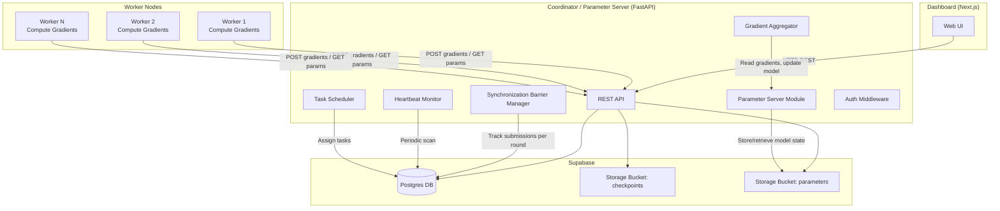
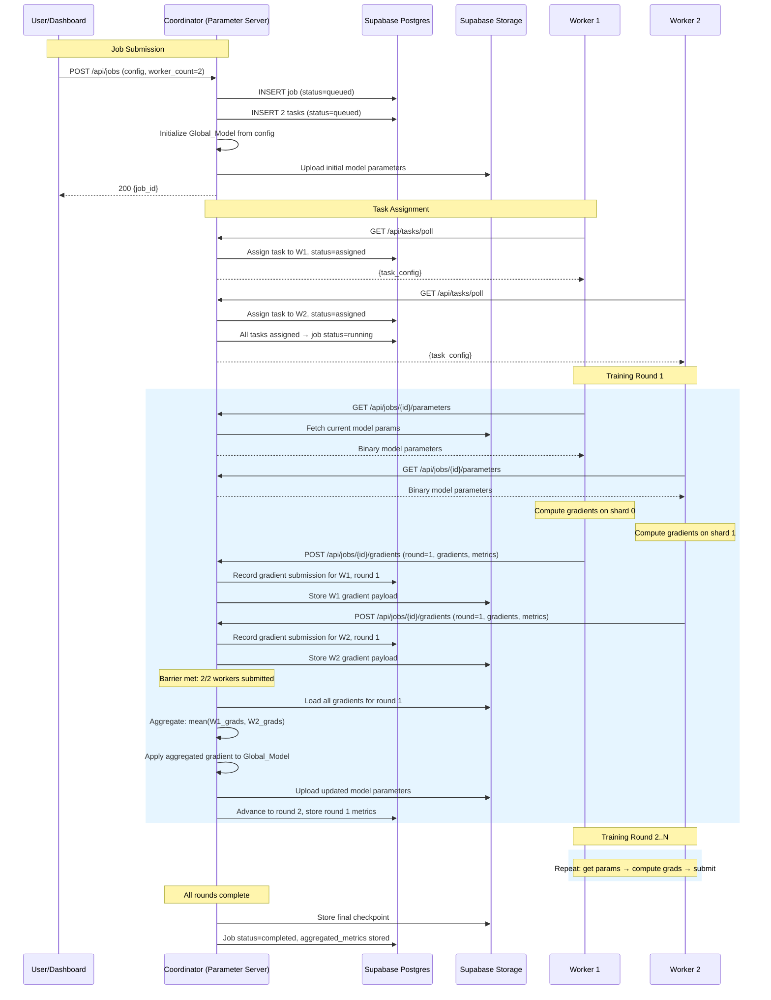

# Design Document: Group ML Trainer — Collaborative Distributed Training

## Overview

Group ML Trainer is a collaborative distributed training platform that pools networked hardware to train a **single shared ML model** across multiple Worker nodes. The system implements a centralized **Parameter Server** pattern: the Coordinator maintains a Global_Model, broadcasts parameters to Workers each training round, collects gradient updates, aggregates them, and applies the update to advance the global model. Workers do not train independently — they compute gradients on their local data shard and participate in a synchronized training loop coordinated by the Coordinator.

The platform has three components: a **Coordinator** (FastAPI backend acting as Parameter Server), **Workers** (Python agents computing gradients), and a **Dashboard** (Next.js frontend showing training convergence). The Coordinator manages the full job lifecycle: node registration, job submission, global model initialization, per-round parameter broadcast, gradient collection with synchronization barriers, gradient aggregation, failure handling, checkpoint storage, and metrics tracking. Workers poll for task assignments, then enter a training loop where each round they download global parameters, compute local gradients, and submit them back. The Dashboard provides real-time visibility into training round progress, per-worker contribution status, and convergence charts.

For the MVP, training uses synchronous SGD with simple gradient averaging. The platform targets PyTorch-based MLP models on small benchmark datasets (MNIST, Fashion-MNIST, synthetic).

### Key Design Decisions

1. **Parameter Server pattern**: The Coordinator acts as a centralized parameter server. This is simpler than all-reduce and fits the existing Coordinator-Worker architecture. Workers never communicate with each other — all gradient exchange flows through the Coordinator.

2. **Synchronous SGD with barriers**: Each training round enforces a synchronization barrier — the Coordinator waits for all active Workers to submit gradients before aggregating and advancing. This produces deterministic training behavior and avoids stale gradient issues at the cost of being bottlenecked by the slowest Worker.

3. **Binary parameter/gradient exchange**: Model parameters and gradients are serialized using PyTorch's native `torch.save`/`torch.load` format and exchanged as binary payloads over HTTP. This avoids JSON serialization overhead for large tensor data.

4. **REST polling preserved**: Workers continue to poll the Coordinator for work and parameter updates. This maintains compatibility with heterogeneous local hardware behind NAT/firewalls. Workers poll for new round parameters rather than receiving push notifications.

5. **Supabase as unified backend**: Postgres for relational data (jobs, tasks, rounds, gradient submissions), Supabase Storage for model checkpoints. The global model state (current parameters) is stored as a binary blob in Supabase Storage, not in Postgres JSONB, to handle potentially large model state_dicts.

6. **Graceful worker failure**: When a Worker fails mid-training, the Coordinator removes it from the active set and adjusts the synchronization barrier. Training continues with remaining Workers. If a Worker already submitted its gradient for the current round before failing, that gradient is included in the aggregation.

7. **Single global checkpoint**: Checkpoints represent the single Global_Model state. There are no per-Worker model checkpoints — only the aggregated global model is saved.

---

## Architecture

### System Architecture Diagram



### Collaborative Training Flow



---

## Components and Interfaces

### 1. Coordinator / Parameter Server (FastAPI Backend)

The Coordinator is the central authority and parameter server. It manages the global model state, orchestrates synchronization barriers, aggregates gradients, and exposes a REST API consumed by Workers and the Dashboard.

#### API Endpoints

| Method | Path | Auth | Consumer | Description |
|--------|------|------|----------|-------------|
| POST | `/api/nodes/register` | None | Worker | Register a new node, returns auth token |
| POST | `/api/nodes/heartbeat` | Token | Worker | Update heartbeat timestamp |
| GET | `/api/nodes` | None | Dashboard | List all nodes with status |
| POST | `/api/jobs` | None | Dashboard | Submit a new training job; initializes Global_Model |
| GET | `/api/jobs` | None | Dashboard | List all jobs |
| GET | `/api/jobs/{id}` | None | Dashboard | Job detail with tasks, round progress, metrics |
| GET | `/api/jobs/{id}/results` | None | Dashboard | Aggregated metrics + final checkpoint path |
| GET | `/api/jobs/{id}/artifacts` | None | Dashboard | List artifacts for a job |
| GET | `/api/jobs/{id}/parameters` | Token | Worker | Download current Global_Model parameters (binary) |
| POST | `/api/jobs/{id}/gradients` | Token | Worker | Submit gradient update for current round (binary + metrics) |
| GET | `/api/tasks/poll` | Token | Worker | Poll for task assignment; returns task config |
| POST | `/api/tasks/{id}/start` | Token | Worker | Mark task as running (first round) |
| POST | `/api/tasks/{id}/fail` | Token | Worker | Report task/worker failure |
| POST | `/api/metrics` | Token | Worker | Report per-round metrics (alternative to inline with gradient) |
| GET | `/api/monitoring/summary` | None | Dashboard | System summary with round progress per job |

> **Removed endpoints**: `POST /api/tasks/{id}/complete` and `POST /api/tasks/{id}/upload-url` are removed. Task completion is now driven by the Coordinator when all training rounds finish — Workers don't individually "complete" since they participate in a shared training loop. Checkpoint upload is handled by the Coordinator (it owns the global model), not by Workers.

#### Internal Modules

- **`auth.py`** — Token generation (`secrets.token_urlsafe`), SHA-256 hashing, FastAPI dependency for token validation. No changes from current implementation.

- **`scheduler.py`** — Task creation from job config (one task per worker). On poll, assigns an eligible queued task to the polling Worker based on resource requirements. Updated to include global model parameter reference in the poll response. When all tasks are assigned, transitions job to "running".

- **`aggregator.py`** — **Major rewrite.** Now implements gradient aggregation instead of independent metrics averaging. Core responsibilities:
  - Load all submitted gradients for a training round from storage.
  - Compute element-wise mean of gradient tensors across all active Workers.
  - Apply the aggregated gradient update to the Global_Model parameters (SGD step).
  - Store updated parameters back to storage.
  - Compute and store per-round global metrics (loss, accuracy from worker reports).
  - On final round completion: mark job as "completed", store final checkpoint.
  - On all-workers-failed: mark job as "failed", store partial checkpoint.

- **`param_server.py`** — **New module.** Manages the Global_Model state:
  - `initialize_model(job_id, job_config)` — Create initial model from config, serialize parameters, upload to storage.
  - `get_parameters(job_id)` — Retrieve current Global_Model parameters from storage.
  - `update_parameters(job_id, new_state_dict)` — Upload updated parameters after aggregation.
  - `store_checkpoint(job_id, round_number)` — Save a checkpoint artifact with metadata.
  - Uses PyTorch `torch.save`/`torch.load` with `state_dict` convention.
  - Storage path convention: `parameters/{job_id}/current.pt` for live parameters, `checkpoints/{job_id}/round_{N}.pt` for checkpoints.

- **`barrier.py`** — **New module.** Synchronization barrier logic:
  - `check_barrier(job_id, round_number)` — Check if all active Workers have submitted gradients for the given round.
  - `get_active_workers(job_id)` — Return the set of Workers still active for a job (not failed/offline).
  - `record_submission(job_id, round_number, node_id)` — Record that a Worker has submitted its gradient.
  - `remove_worker(job_id, node_id)` — Remove a Worker from the active set (on failure/offline).
  - Barrier is met when `submitted_workers == active_workers` for the current round.

- **`heartbeat.py`** — Background staleness monitor. Updated to handle mid-training failures: when a node goes offline with an active task in a running job, marks the task as "failed", removes the Worker from the job's active set via `barrier.py`, and checks if the barrier is now met (remaining workers may have already submitted).

- **`config_parser.py`** — Parses and validates job configurations. Updated: `shard_count` field renamed to `worker_count` in the API-facing model (internally still maps to shard_count for dataset partitioning). Generates task configs with worker-specific shard assignments.

- **`models.py`** — Pydantic models for API request/response schemas. Updated with new models for gradient submission, parameter download, and round tracking.

- **`db.py`** — Supabase client initialization and query helpers. No changes needed.

- **`storage.py`** — Supabase Storage client. Updated to handle parameter blob upload/download in addition to checkpoint management. Workers no longer upload directly — the Coordinator manages all storage writes for model state.

- **`dashboard.py`** — Dashboard-facing read endpoints. Updated to include training round progress, per-worker contribution status, and convergence data in job detail responses.

### 2. Worker (Python Agent)

The Worker is a standalone Python process. Its lifecycle changes significantly from independent training to collaborative gradient computation.

#### Worker Lifecycle (New)

1. **Register** — POST hardware info to Coordinator, receive and store auth token locally.
2. **Heartbeat loop** — Send heartbeat every 10 seconds in a background thread.
3. **Poll loop** — Poll `/api/tasks/poll` every 5 seconds. When a task is received, enter the training loop.
4. **Start task** — POST `/api/tasks/{id}/start` to Coordinator.
5. **Training loop** (repeats for each Training_Round):
   a. **Download parameters** — GET `/api/jobs/{id}/parameters` to receive current Global_Model parameters.
   b. **Set local model** — Load received parameters into local model instance.
   c. **Compute gradients** — Forward + backward pass on local data shard. Compute local loss and accuracy.
   d. **Submit gradients** — POST `/api/jobs/{id}/gradients` with serialized gradient tensors and local metrics.
   e. **Wait for next round** — Poll for updated parameters (the Coordinator advances the round after aggregation).
6. **Training complete** — When the Coordinator signals training is done (e.g., parameter download returns a "completed" status), the Worker exits the training loop.
7. **Return to polling** — Resume polling for new tasks.

#### Internal Modules

- **`worker/main.py`** — Entry point. Handles registration, starts heartbeat and poll loops. Updated `_execute_task` to call the new collaborative training loop instead of independent training.

- **`worker/trainer.py`** — **Major rewrite.** No longer runs an independent training loop with local optimizer steps. Instead:
  - `run_task()` enters a round-based loop.
  - Each round: download global params → set model weights → forward/backward pass on shard → collect gradients → submit gradients + metrics.
  - The Worker does NOT call `optimizer.step()` — it only computes gradients. The Coordinator applies the optimizer step during aggregation.
  - Handles round synchronization by polling for parameter updates.

- **`worker/datasets.py`** — Dataset loading and shard partitioning. No changes needed — Workers still load their assigned shard.

- **`worker/models.py`** — MLP model definition. No changes needed — model architecture is the same, but weights come from the Coordinator.

- **`worker/reporter.py`** — HTTP client for Coordinator communication. Updated with new methods:
  - `download_parameters(job_id)` — GET binary model parameters.
  - `submit_gradients(job_id, round_number, gradients, metrics)` — POST binary gradient payload with metrics.
  - Removed: `request_upload_url()`, `complete_task()` (Workers no longer upload checkpoints or individually complete).

- **`worker/config.py`** — Task configuration parsing. Updated to include `total_rounds` (epochs) so the Worker knows how many rounds to expect.

- **`worker/storage.py`** — **Simplified or removed.** Workers no longer upload checkpoints directly. The Coordinator handles all model storage.

### 3. Dashboard (Next.js Frontend)

The Dashboard is updated to show collaborative training progress instead of independent task progress.

#### Pages

- **`/`** — System overview: summary metrics (online nodes, running jobs, current training rounds), quick links.
- **`/nodes`** — Node list with status indicators, hardware details, last heartbeat. No major changes.
- **`/jobs`** — Job list with status, model type, dataset, worker count, current round, timestamps.
- **`/jobs/[id]`** — **Updated job detail**:
  - Training round progress bar (current round / total rounds).
  - Per-Worker contribution status table: Worker ID, status (waiting/computing/submitted), last submission round.
  - Global metrics per round: loss and accuracy after each aggregation.
  - Convergence chart: global loss and accuracy plotted across training rounds.
  - Final model checkpoint download link on completion.
  - Per-Worker error messages on failure.
- **`/jobs/new`** — Job submission form. `shard_count` renamed to `worker_count` in the UI.

#### Data Fetching

- Uses SWR for polling-based data refresh (5-second intervals for running jobs, 10-second for overview).
- All data fetched from Coordinator REST API.

---

## Data Models

### Database Schema Changes

The existing schema needs several additions to support collaborative training. Existing tables (`nodes`, `jobs`, `tasks`, `metrics`, `artifacts`) are preserved with modifications. New tables are added for training round tracking and gradient submissions.

#### `nodes` Table — No Changes

| Column | Type | Description |
|--------|------|-------------|
| `id` | UUID (PK) | Internal database ID |
| `node_id` | TEXT (unique) | Worker-provided identifier |
| `hostname` | TEXT | Machine hostname |
| `cpu_cores` | INTEGER | Number of CPU cores |
| `gpu_model` | TEXT (nullable) | GPU model name |
| `vram_mb` | INTEGER (nullable) | GPU VRAM in MB |
| `ram_mb` | INTEGER | System RAM in MB |
| `disk_mb` | INTEGER | Available disk in MB |
| `os` | TEXT | Operating system |
| `python_version` | TEXT | Python version |
| `pytorch_version` | TEXT | PyTorch version |
| `status` | TEXT | One of: `idle`, `busy`, `offline` |
| `last_heartbeat` | TIMESTAMPTZ | Last heartbeat timestamp |
| `auth_token_hash` | TEXT | SHA-256 hash of auth token |
| `created_at` | TIMESTAMPTZ | Registration timestamp |

#### `jobs` Table — Modified

| Column | Type | Description |
|--------|------|-------------|
| `id` | UUID (PK) | Job ID |
| `job_name` | TEXT (nullable) | Optional human-readable name |
| `dataset_name` | TEXT | Dataset: MNIST, Fashion-MNIST, synthetic |
| `model_type` | TEXT | Model type: MLP |
| `hyperparameters` | JSONB | Training hyperparameters |
| `shard_count` | INTEGER | Number of workers/shards (>0) |
| `status` | TEXT | One of: `queued`, `running`, `completed`, `failed` |
| `current_round` | INTEGER (new) | Current training round number (0-indexed), NULL when queued |
| `total_rounds` | INTEGER (new) | Total training rounds (= epochs from hyperparameters) |
| `global_model_path` | TEXT (new, nullable) | Storage path to current Global_Model parameters |
| `aggregated_metrics` | JSONB (nullable) | Per-round global metrics history |
| `error_summary` | JSONB (nullable) | Per-worker error messages on failure |
| `created_at` | TIMESTAMPTZ | Submission timestamp |
| `started_at` | TIMESTAMPTZ (nullable) | When training started |
| `completed_at` | TIMESTAMPTZ (nullable) | When job completed or failed |

#### `tasks` Table — Modified

Tasks now represent a Worker's ongoing participation in the training loop, not a one-shot training run.

| Column | Type | Description |
|--------|------|-------------|
| `id` | UUID (PK) | Task ID |
| `job_id` | UUID (FK → jobs) | Parent job |
| `node_id` | UUID (FK → nodes, nullable) | Assigned worker node |
| `shard_index` | INTEGER | Dataset shard index for this worker |
| `status` | TEXT | One of: `queued`, `assigned`, `running`, `completed`, `failed` |
| `task_config` | JSONB | Task configuration payload |
| `last_submitted_round` | INTEGER (new, nullable) | Last round for which this worker submitted gradients |
| `error_message` | TEXT (nullable) | Error details if failed |
| `assigned_at` | TIMESTAMPTZ (nullable) | When assigned to a node |
| `started_at` | TIMESTAMPTZ (nullable) | When worker started training loop |
| `completed_at` | TIMESTAMPTZ (nullable) | When task completed or failed |
| `created_at` | TIMESTAMPTZ | Task creation timestamp |

> **Removed columns**: `checkpoint_path` — Workers no longer produce individual checkpoints. The Global_Model checkpoint is stored at the job level.

#### `training_rounds` Table — New

Tracks the state of each training round for synchronization barrier management.

| Column | Type | Description |
|--------|------|-------------|
| `id` | UUID (PK) | Round record ID |
| `job_id` | UUID (FK → jobs) | Parent job |
| `round_number` | INTEGER | Training round number (0-indexed) |
| `status` | TEXT | One of: `in_progress`, `aggregating`, `completed` |
| `active_worker_count` | INTEGER | Number of active workers expected for this round |
| `submitted_count` | INTEGER | Number of gradient submissions received |
| `global_loss` | NUMERIC (nullable) | Global loss after aggregation |
| `global_accuracy` | NUMERIC (nullable) | Global accuracy after aggregation |
| `started_at` | TIMESTAMPTZ | When this round started |
| `completed_at` | TIMESTAMPTZ (nullable) | When aggregation completed |
| `created_at` | TIMESTAMPTZ | Record creation timestamp |

#### `gradient_submissions` Table — New

Records individual gradient submissions from Workers for each training round.

| Column | Type | Description |
|--------|------|-------------|
| `id` | UUID (PK) | Submission record ID |
| `job_id` | UUID (FK → jobs) | Parent job |
| `task_id` | UUID (FK → tasks) | Submitting task |
| `node_id` | UUID (FK → nodes, nullable) | Submitting node |
| `round_number` | INTEGER | Training round this gradient is for |
| `gradient_path` | TEXT | Storage path to serialized gradient tensors |
| `local_loss` | NUMERIC (nullable) | Loss computed on this worker's shard |
| `local_accuracy` | NUMERIC (nullable) | Accuracy computed on this worker's shard |
| `created_at` | TIMESTAMPTZ | Submission timestamp |

#### `metrics` Table — Modified

Now stores per-round global metrics in addition to per-worker metrics.

| Column | Type | Description |
|--------|------|-------------|
| `id` | UUID (PK) | Metric record ID |
| `job_id` | UUID (FK → jobs) | Parent job |
| `task_id` | UUID (FK → tasks, nullable) | Parent task (NULL for global metrics) |
| `node_id` | UUID (FK → nodes, nullable) | Reporting node (NULL for global metrics) |
| `round_number` | INTEGER (renamed from epoch) | Training round number |
| `metric_type` | TEXT (new) | One of: `worker_local`, `global_aggregated` |
| `loss` | NUMERIC (nullable) | Training loss |
| `accuracy` | NUMERIC (nullable) | Training accuracy |
| `created_at` | TIMESTAMPTZ | Report timestamp |

#### `artifacts` Table — Modified

| Column | Type | Description |
|--------|------|-------------|
| `id` | UUID (PK) | Artifact record ID |
| `job_id` | UUID (FK → jobs) | Parent job |
| `task_id` | UUID (FK → tasks, nullable) | Now nullable — global checkpoints have no task |
| `node_id` | UUID (FK → nodes, nullable) | Producing node (NULL for global checkpoints) |
| `artifact_type` | TEXT | One of: `checkpoint`, `log`, `output` |
| `storage_path` | TEXT | Path in Supabase Storage |
| `round_number` | INTEGER (renamed from epoch, nullable) | Round number for checkpoints |
| `size_bytes` | BIGINT (nullable) | File size |
| `created_at` | TIMESTAMPTZ | Upload timestamp |

### Supabase Storage

- **Bucket `checkpoints`**: Final model checkpoints. Path: `{job_id}/final.pt` (single global model).
- **Bucket `parameters`** (new): Live model parameters during training. Path: `parameters/{job_id}/current.pt`.
- **Bucket `gradients`** (new): Per-round gradient submissions. Path: `gradients/{job_id}/round_{N}/node_{node_id}.pt`. Cleaned up after aggregation.

### Pydantic Models (API Layer)

```python
# --- Request Models ---

class NodeRegistrationRequest(BaseModel):
    node_id: str
    hostname: str
    cpu_cores: int = Field(gt=0)
    gpu_model: str | None = None
    vram_mb: int | None = None
    ram_mb: int = Field(gt=0)
    disk_mb: int = Field(gt=0)
    os: str
    python_version: str
    pytorch_version: str

class JobSubmissionRequest(BaseModel):
    job_name: str | None = None
    dataset_name: str
    model_type: str
    hyperparameters: dict = Field(default_factory=dict)
    shard_count: int = Field(gt=0)  # Number of workers

class GradientSubmissionRequest(BaseModel):
    """Metadata sent alongside the binary gradient payload."""
    round_number: int = Field(ge=0)
    task_id: str
    local_loss: float | None = None
    local_accuracy: float | None = None

class TaskFailRequest(BaseModel):
    error_message: str

# --- Response Models ---

class NodeRegistrationResponse(BaseModel):
    node_db_id: str
    auth_token: str

class JobSubmissionResponse(BaseModel):
    job_id: str

class TaskPollResponse(BaseModel):
    task_id: str | None = None
    job_id: str | None = None
    dataset_name: str | None = None
    model_type: str | None = None
    hyperparameters: dict | None = None
    shard_index: int | None = None
    shard_count: int | None = None
    total_rounds: int | None = None  # New: so worker knows how many rounds

class ParameterDownloadResponse(BaseModel):
    """Metadata returned alongside binary parameter payload."""
    job_id: str
    current_round: int
    job_status: str  # "running" or "completed"

class RoundStatus(BaseModel):
    """Status of a training round for dashboard display."""
    round_number: int
    status: str  # in_progress, aggregating, completed
    active_worker_count: int
    submitted_count: int
    global_loss: float | None = None
    global_accuracy: float | None = None
```

### Internal Configuration Models

```python
class HyperParameters(BaseModel):
    learning_rate: float = Field(gt=0, default=0.001)
    epochs: int = Field(gt=0, default=10)
    batch_size: int = Field(gt=0, default=32)
    hidden_layers: list[int] = Field(default_factory=lambda: [128, 64])
    activation: str = Field(default="relu")

class JobConfig(BaseModel):
    dataset_name: str
    model_type: str
    hyperparameters: HyperParameters
    shard_count: int = Field(gt=0)

class TaskConfig(BaseModel):
    task_id: str
    job_id: str
    dataset_name: str
    model_type: str
    hyperparameters: HyperParameters
    shard_index: int
    shard_count: int
    total_rounds: int  # New: derived from hyperparameters.epochs
```

---

## Correctness Properties

*A property is a characteristic or behavior that should hold true across all valid executions of a system — essentially, a formal statement about what the system should do. Properties serve as the bridge between human-readable specifications and machine-verifiable correctness guarantees.*

### Property 1: Registration rejects requests with missing required fields

*For any* subset of registration fields that omits at least one required field (node_id, hostname, cpu_cores, ram_mb, disk_mb, os, python_version, pytorch_version), the Coordinator's registration validator SHALL reject the request and the error response SHALL list exactly the missing fields.

**Validates: Requirements 1.3**

### Property 2: Heartbeat staleness detection marks correct nodes offline

*For any* set of registered nodes with random `last_heartbeat` timestamps, running the heartbeat staleness check against a reference time SHALL mark exactly those nodes whose `last_heartbeat` is more than 30 seconds before the reference time as "offline", and SHALL leave all other nodes' statuses unchanged.

**Validates: Requirements 2.2**

### Property 3: Job validation rejects unsupported dataset or model type

*For any* job submission where `dataset_name` is not in {MNIST, Fashion-MNIST, synthetic} or `model_type` is not in {MLP}, the Coordinator's job validator SHALL reject the submission and the error response SHALL list the supported options.

**Validates: Requirements 3.2**

### Property 4: Job submission rejects worker count exceeding idle node count

*For any* pair of (shard_count, idle_node_count) where shard_count > idle_node_count, the Coordinator SHALL reject the job submission. Conversely, for any pair where shard_count <= idle_node_count and the job config is otherwise valid, the submission SHALL be accepted.

**Validates: Requirements 3.3**

### Property 5: Job validation rejects configs with missing required fields

*For any* job configuration dictionary that omits at least one required field (dataset_name, model_type, shard_count), the Coordinator's job validator SHALL reject the configuration and the error response SHALL identify the missing fields.

**Validates: Requirements 3.4**

### Property 6: Task creation produces correct count and shard indices

*For any* valid job with shard_count N (where 1 ≤ N ≤ 100), the scheduler SHALL create exactly N tasks, each with a unique `shard_index` from the set {0, 1, ..., N-1}, and all tasks SHALL reference the parent job ID.

**Validates: Requirements 4.1**

### Property 7: Global model initialization matches job configuration

*For any* valid job configuration specifying a model type and hyperparameters (hidden_layers, activation), the initialized Global_Model SHALL have a `state_dict` whose layer dimensions match the specified architecture — input size derived from the dataset, hidden layer widths matching the config, and output size matching the dataset's class count.

**Validates: Requirements 4.2**

### Property 8: Worker gradient computation produces correctly shaped tensors

*For any* valid model architecture and data shard, computing gradients on the shard SHALL produce a gradient dict whose keys match the model's `state_dict` keys and whose tensor shapes match the corresponding parameter shapes.

**Validates: Requirements 5.1**

### Property 9: Synchronization barrier enforces all-submit-before-advance

*For any* set of N active Workers and any subset S of those Workers that have submitted gradients for a round, the barrier SHALL report "met" if and only if |S| = N. The round number SHALL NOT advance until the barrier is met.

**Validates: Requirements 5.2, 5.5**

### Property 10: Gradient aggregation computes correct element-wise mean

*For any* set of K gradient dicts (where K ≥ 1), each containing tensors with identical keys and shapes, the aggregated gradient SHALL have the same keys and shapes, and each tensor value SHALL equal the element-wise arithmetic mean of the corresponding tensors across all K inputs.

**Validates: Requirements 5.3**

### Property 11: Per-round aggregated metrics correctly computed

*For any* set of per-Worker local metrics (loss, accuracy) submitted for a training round, the stored global metrics SHALL have `global_loss` equal to the arithmetic mean of all worker losses and `global_accuracy` equal to the arithmetic mean of all worker accuracies, with a per-Worker breakdown preserving individual values.

**Validates: Requirements 6.2**

### Property 12: Job failure with partial checkpoint when all workers fail

*For any* job where at least one task has status "failed" and no tasks remain with status "queued", "assigned", or "running", the Coordinator SHALL mark the job as "failed", include per-Worker error messages, and store the last successfully aggregated Global_Model parameters as a partial checkpoint. For any job where at least one task is still active, the job SHALL NOT be marked as "failed".

**Validates: Requirements 6.4, 14.3**

### Property 13: Synchronization barrier adjusts when workers are removed

*For any* job with N active Workers, when a Worker is removed from the active set (due to failure or going offline), the barrier for subsequent rounds SHALL expect only N-1 submissions. If the removed Worker had already submitted for the current round, its gradient SHALL be included in the current round's aggregation.

**Validates: Requirements 6.5, 14.2, 14.4**

### Property 14: Auth token validation accepts valid tokens and rejects invalid ones

*For any* registered node with a known auth token, requests bearing that token SHALL be authenticated successfully. *For any* string that does not match any registered node's token, requests bearing that string SHALL be rejected with HTTP 401.

**Validates: Requirements 8.1, 8.2**

### Property 15: Auth tokens are unique across all registered nodes

*For any* set of N successfully registered nodes, all N issued auth tokens SHALL be pairwise distinct.

**Validates: Requirements 8.3**

### Property 16: Monitoring summary returns correct counts including round progress

*For any* set of nodes with random statuses (idle, busy, offline) and jobs with random statuses (queued, running, completed, failed) and random current_round values, the monitoring summary SHALL return counts that exactly match the number of nodes/jobs in each status category, and SHALL include the current training round for each running job.

**Validates: Requirements 11.2**

### Property 17: Config validation reports invalid field types and out-of-range values

*For any* job configuration containing at least one field with an incorrect type (e.g., string where int expected) or an out-of-range value (e.g., shard_count ≤ 0, learning_rate ≤ 0), the Coordinator's config validator SHALL return a validation error that identifies the invalid fields and describes the expected type or range.

**Validates: Requirements 12.2**

### Property 18: JobConfig serialization round-trip preserves data

*For any* valid `JobConfig` object, serializing it into a task configuration payload and then deserializing back into a `JobConfig` SHALL produce an object with identical field values to the original.

**Validates: Requirements 12.3, 12.4**

### Property 19: Model parameter serialization round-trip preserves tensor values

*For any* valid Global_Model `state_dict` containing tensors of various shapes and dtypes, serializing with `torch.save` and deserializing with `torch.load` SHALL produce a `state_dict` with identical keys, tensor shapes, and tensor values (exact floating-point equality).

**Validates: Requirements 13.5**

### Property 20: Round validation rejects mismatched round numbers

*For any* gradient submission where the submitted `round_number` does not equal the job's `current_round`, the Coordinator SHALL reject the submission with a descriptive error message. Submissions where `round_number` equals `current_round` SHALL be accepted (assuming the Worker is active and hasn't already submitted for this round).

**Validates: Requirements 13.3**

### Property 21: Stale worker with active task triggers task failure and active set removal

*For any* Worker whose heartbeat is stale (>30 seconds) and who has an active task in a running job, the Coordinator SHALL mark the Worker's task as "failed" with an appropriate error message AND remove the Worker from the job's active Worker set, adjusting the synchronization barrier for subsequent rounds.

**Validates: Requirements 14.1, 14.2**

---

## Error Handling

### Coordinator Error Handling

| Error Scenario | HTTP Status | Response | Recovery |
|---|---|---|---|
| Missing/invalid auth token | 401 | `{"error": "Unauthorized", "detail": "..."}` | Worker must stop and require operator intervention |
| Duplicate node_id registration | 409 | `{"error": "Conflict", "detail": "node_id already registered"}` | Worker uses existing registration or picks new node_id |
| Missing required fields | 422 | `{"error": "Validation Error", "detail": [{field, message}]}` | Client fixes payload |
| Unsupported dataset/model | 422 | `{"error": "Validation Error", "detail": "...", "supported": [...]}` | Client picks supported option |
| Worker count > idle nodes | 400 | `{"error": "Insufficient Nodes", "detail": "...", "idle_count": N}` | User reduces worker count or waits for nodes |
| Gradient for wrong round | 409 | `{"error": "Round Mismatch", "detail": "Expected round X, got Y"}` | Worker re-downloads current parameters and retries |
| Duplicate gradient submission | 409 | `{"error": "Already Submitted", "detail": "..."}` | Worker ignores — already submitted for this round |
| Parameter download for non-running job | 404 | `{"error": "Not Found", "detail": "Job not running"}` | Worker exits training loop |
| Checkpoint upload failure | — | — | Coordinator retries once; if retry fails, job marked completed with warning |
| Node goes offline with active task | — | — | Task marked "failed", worker removed from active set, barrier adjusted |
| All workers fail for a job | — | — | Job marked "failed", partial checkpoint stored |
| Task not found | 404 | `{"error": "Not Found"}` | Client checks task ID |
| Job not found | 404 | `{"error": "Not Found"}` | Client checks job ID |
| Database connection failure | 503 | `{"error": "Service Unavailable"}` | Retry with backoff |
| Gradient storage failure | 500 | `{"error": "Storage Error"}` | Worker retries submission |

### Worker Error Handling

| Error Scenario | Behavior | Recovery |
|---|---|---|
| Gradient computation error (OOM, NaN) | Report failure to Coordinator, exit training loop | Coordinator removes worker from active set, adjusts barrier |
| Parameter download failure | Retry with exponential backoff | Resume when Coordinator is reachable |
| Gradient submission failure | Retry with exponential backoff | Resume when Coordinator is reachable |
| Round mismatch (409) | Re-download current parameters, recompute for correct round | Self-correcting |
| Coordinator unreachable | Buffer state locally, retry with backoff | Resume when Coordinator is reachable |
| Auth token rejected (401) | Stop all loops, delete state file, exit | Operator must re-register |
| Job completed during training | Coordinator returns "completed" status on parameter download | Worker exits training loop, returns to polling |

### Job-Level Failure Semantics

- If **all training rounds complete**: Job status → "completed", final Global_Model checkpoint stored, per-round aggregated metrics stored.
- If **a Worker fails** but others remain active: Worker removed from active set, barrier adjusted, training continues with remaining Workers.
- If **all Workers fail**: Job status → "failed", error_summary populated with per-Worker errors, last successfully aggregated Global_Model stored as partial checkpoint.
- If **a Worker fails after submitting gradient for current round**: Gradient included in current round's aggregation, Worker removed from subsequent rounds.
- Partial results (per-round metrics, partial checkpoints) are preserved — the system does not discard completed round data when a job fails.

---

## Testing Strategy

### Testing Framework and Tools

- **Backend (Python/FastAPI)**: pytest + pytest-asyncio for unit/integration tests, **Hypothesis** for property-based testing
- **Frontend (Next.js)**: Jest + React Testing Library for component tests
- **Integration**: httpx test client for FastAPI endpoint testing with test database

### Property-Based Testing (Hypothesis)

Property-based tests validate the 21 correctness properties defined above. Each property test:
- Targets a **minimum of 100 examples per property in development**, with configurable higher counts in CI
- Is tagged with a comment referencing the design property: `# Feature: group-ml-trainer, Property N: <title>`
- Uses Hypothesis strategies to generate:
  - Random registration payloads (valid and invalid)
  - Random job configurations with various field combinations
  - Random sets of nodes with random statuses and timestamps
  - Random gradient tensors with various shapes and values
  - Random sets of active workers with partial submission states
  - Random metric values (loss, accuracy)
  - Random round numbers for barrier and round validation testing
  - Random auth tokens

#### Property Test Organization

```
tests/
  properties/
    test_registration_validation.py    # Property 1
    test_heartbeat_staleness.py        # Property 2
    test_job_validation.py             # Properties 3, 4, 5
    test_task_scheduling.py            # Property 6
    test_model_init.py                 # Property 7
    test_gradient_computation.py       # Property 8
    test_barrier.py                    # Properties 9, 13
    test_gradient_aggregation.py       # Property 10
    test_round_metrics.py             # Property 11
    test_job_failure.py                # Property 12
    test_auth.py                       # Properties 14, 15
    test_monitoring.py                 # Property 16
    test_config_validation.py          # Properties 17, 18
    test_param_roundtrip.py            # Property 19
    test_round_validation.py           # Property 20
    test_stale_worker.py               # Property 21
```

### Unit Tests (Example-Based)

Unit tests cover specific examples, edge cases, and scenarios not suited for PBT:

- **Registration**: Successful registration returns token and sets status to "idle" (1.4), duplicate node_id rejected (1.2)
- **Heartbeat**: Offline node recovers to "idle" on heartbeat (2.3), health endpoint returns all nodes (2.4)
- **Job submission**: Valid job creates record with "queued" status and initializes Global_Model (3.1), supported datasets accepted (3.5, 3.6)
- **Task assignment**: Assigned task returned to polling worker with model parameter reference (4.4), no task returns empty (4.5), job status set to "running" when all tasks assigned (4.3)
- **Training loop**: Worker submits gradients with metrics for each round (5.6), parameter download returns updated params after aggregation (5.4)
- **Completion**: Job marked completed after all rounds with final checkpoint (6.1), results endpoint returns per-round metrics and checkpoint path (6.3)
- **Checkpoints**: Final checkpoint represents single Global_Model (7.5), checkpoint metadata includes job_id and round number (7.2), upload retry on failure (7.4)
- **Auth**: Token revocation rejects requests (8.4)
- **Dashboard**: Node list renders with status indicators (9.1, 9.3), job list with round progress (10.1), job detail shows per-worker contribution status and convergence chart data (10.2, 10.3)
- **Gradient protocol**: Parameter download returns binary payload (13.1), gradient submission accepts binary payload (13.2), PyTorch serialization format used (13.4)
- **Logging**: All event types logged with timestamps (11.1), worker failure logs include round number (11.3)

### Integration Tests

Integration tests verify end-to-end flows against a test Supabase instance:

1. **Full collaborative training lifecycle**: Register 2 nodes → submit job with worker_count=2 → tasks assigned → Workers download params → compute gradients → submit gradients → barrier met → aggregation → repeat for all rounds → job completed with final checkpoint and per-round metrics
2. **Worker failure mid-training**: Register 3 nodes → submit job → start training → one worker fails at round 2 → barrier adjusts → remaining 2 workers continue → job completes
3. **All workers fail**: Register 2 nodes → submit job → both workers fail → job marked failed with partial checkpoint
4. **Heartbeat lifecycle**: Register node → heartbeat updates timestamp → stop heartbeat → node marked offline → task failed → barrier adjusted → resume heartbeat → node recovers to idle
5. **Dashboard data flow**: Submit job → verify Dashboard API returns correct round progress, per-worker status, and convergence data at each stage
6. **Round validation**: Worker submits gradient for wrong round → 409 rejected → Worker re-syncs and submits for correct round

### Test Configuration

```python
# conftest.py — Hypothesis settings
from hypothesis import settings

settings.register_profile("ci", max_examples=200)
settings.register_profile("dev", max_examples=100)
settings.load_profile("dev")
```
